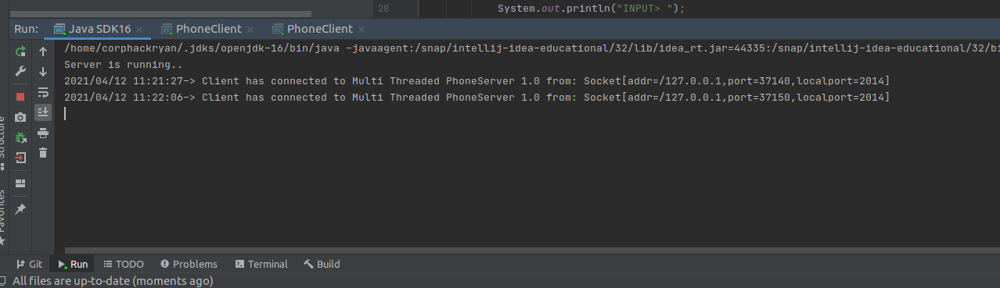
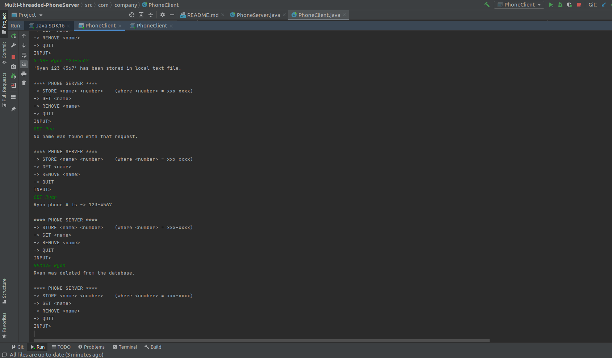

# PHONE SERVER v1.0
Ryan OConnor

*A client/server model with a built-in address book system*. This program will display a menu with the following options: STORE, GET, REMOVE or QUIT. A short description of what each option does is below:
* STORE (name) (number) - When this is invoked, the name and number will be added to the address book on the server side.
* GET (name) - when this is invoked, the server will return the phone number associated with the given name.
* REMOVE (name) - when this is invoked, server will remove the name and phone number from the address book on the local side.
* QUIT - client will disconnect from server. 

___

This program was built to meet the following scope:

###*CLIENT SIDE*
* Requests a connection with the server
* Send three types of messages:
  * STORE
  * GET
  * REMOVE
    
###*SERVER SIDE*
* Accept requested connections and support multiple connections via thread extender
* Maintain an appropriate data structure to hold data from client.
* Process all specific message requests from client
___
# Screenshots
### Multiple connections to server

### Example of STORE/GET/REMOVE output

